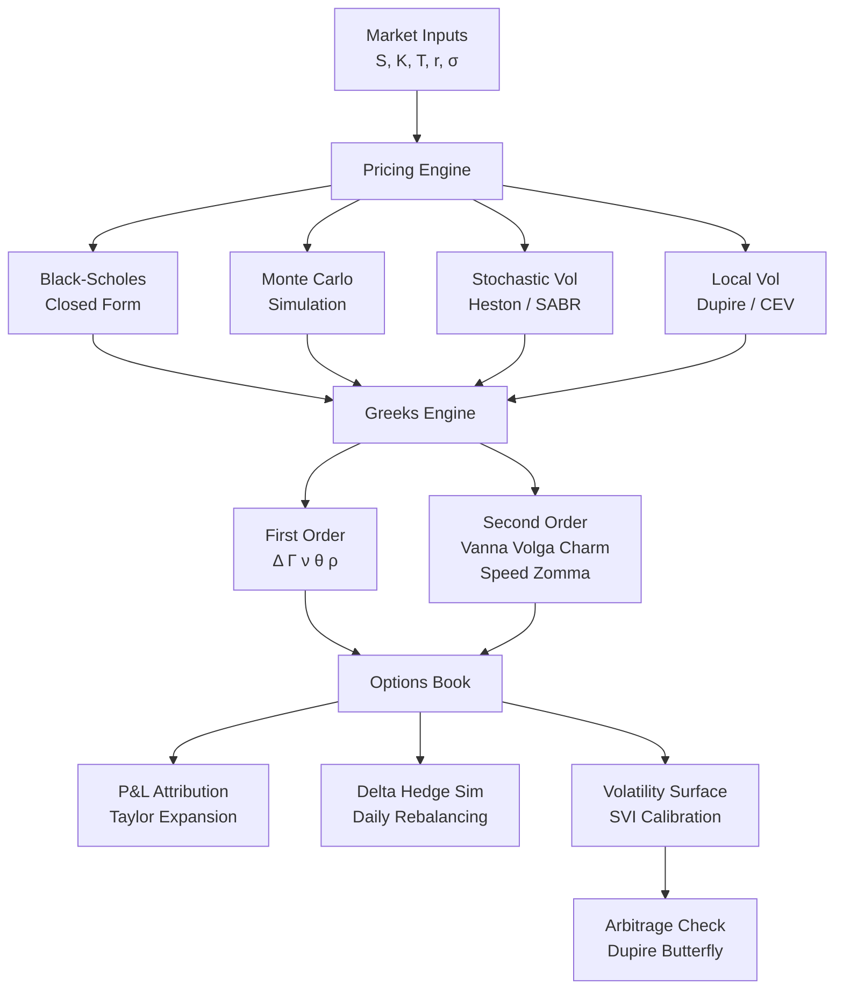
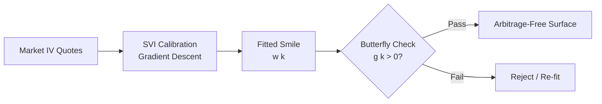

# Options Greeks Pricer

A complete options pricing and risk management engine built in pure Python. Prices European and exotic options using Black-Scholes, Monte Carlo simulation, and stochastic volatility models. Computes the full Greeks suite — from delta and gamma through to vanna, volga, and charm — and runs real delta-hedging simulations with P&L attribution.

No external dependencies. Pure Python 3.8+ standard library only.

---

## How It Works



---

## What It Can Price

| Instrument | Method | Notes |
|---|---|---|
| European calls & puts | Black-Scholes exact | Full closed-form Greeks |
| American options | Binomial / trinomial tree | Early exercise boundary |
| Barrier options | Reiner-Rubinstein analytical | 6 barrier types (up/down in/out) |
| Asian options | Geometric closed-form + arithmetic MC | Control variate variance reduction |
| Lookback options | Floating & fixed strike | Monte Carlo |
| Forward-starting options | Adjusted BS with forward vol | |
| Basket / spread options | Multi-asset Monte Carlo | Correlated Brownian motions |
| Interest rate caplets/floorlets | Black's model | Yield curve bootstrapped |
| Swaptions | Black's model | Co-terminal swap |

---

## Greeks Output (Sample)

```
ATM Call  S=100  K=100  T=0.5  σ=20%  r=5%

Price : 6.8887
Delta : +0.5977   (dP/dS)
Gamma : +0.027359  (d²P/dS²)
Vega  : +0.2736   (dP per 1% σ move)
Theta : -0.0222   (dP per calendar day)
Rho   : +0.2644   (dP per 1% rate move)
Vanna : -0.2052   (dΔ/dσ — cross-Greek)
Volga : +3.5908   (d²P/dσ²  vol convexity)
Charm : -0.000262  (dΔ/dt per day — delta bleed)
Speed : -0.000752  (dΓ/dS)
Zomma : -0.133202  (dΓ/dσ)
```

---

## P&L Attribution (Sample)

The Taylor-expansion decomposition breaks a $1,762 P&L move into its Greek components:

```
Position: Long ATM Call (qty=10)  |  dS=+2, dσ=+2%, dT=1 day

Component    |        P&L
-----------------------------
delta        |   +$1,195.47   ← dominant driver
gamma        |     +$54.72    ← convexity benefit
vega         |    +$547.17    ← vol expansion
theta        |     -$22.24    ← time decay
vanna        |      -$8.21    ← cross exposure
volga        |     +$71.82    ← vol-of-vol
-----------------------------
Estimated    |   +$1,838.73
Actual       |   +$1,761.23
Error        |     +$77.50    (4.4% — higher order terms)
```

---

## Volatility Surface

The SVI (Stochastic Volatility Inspired) parameterisation fits the entire implied vol smile:

```
w(k) = a + b · [ρ(k−m) + √((k−m)² + σ²)]
```

The engine calibrates `{a, b, ρ, m, σ}` via gradient descent and validates the surface is free of butterfly arbitrage using the Dupire local vol check g(k) > 0.



---

## Stochastic Volatility (Heston Model)

```
dS = μS dt + √v · S dW₁
dv = κ(θ−v) dt + ξ√v dW₂     corr(dW₁,dW₂) = ρ
```

Pricing uses the **Gil-Pelaez inversion** of the Heston characteristic function — no Monte Carlo needed for vanilla options. MC is used for path-dependent payoffs with the **full-truncation Euler scheme** for variance process stability.

---

## Running It

```bash
git clone https://github.com/Krish-1717/options-greeks-pricer
cd options-greeks-pricer

# Run any module
python quant_code/options_day26_stochastic_vol.py
python quant_code/options_day28_vol_surface_svi.py
python quant_code/options_day30_greeks_book.py

# Run all modules
python run_demos.py
```

**Requirements:** Python 3.8+, no pip install needed.

---

## Project Structure

```
options-greeks-pricer/
├── greeks.py                         # Black-Scholes pricing + core Greeks
├── analytics/                        # Implied vol solvers, moneyness
├── models/                           # Binomial/trinomial trees
├── pricing/                          # Monte Carlo with variance reduction
├── calibration/                      # Heston & SABR calibration
├── volatility/                       # SABR smile, term structure
├── hedging/                          # Delta hedging P&L simulation
├── exotics/                          # Barrier, Asian, digital
├── risk/                             # VaR, scenario stress testing
└── quant_code/
    ├── options_day20_smile_interpolation.py  # Cubic spline / SABR smile
    ├── options_day21_multi_asset.py          # Spread, basket, quanto
    ├── options_day22_scenario_analysis.py   # Greeks scenario grids
    ├── options_day23_jump_diffusion.py       # Merton / Kou models
    ├── options_day24_tail_risk_hedging.py    # OTM put tail protection
    ├── options_day25_local_volatility.py     # Dupire, CEV, finite diff
    ├── options_day26_stochastic_vol.py       # Heston CF, SABR Hagan
    ├── options_day27_exotic_options.py       # Barrier, Asian, lookback
    ├── options_day28_vol_surface_svi.py      # SVI calibration + arb check
    ├── options_day29_interest_rate_derivs.py # Yield curve, caps, swaptions
    └── options_day30_greeks_book.py          # Full book: vanna/volga/charm
```
